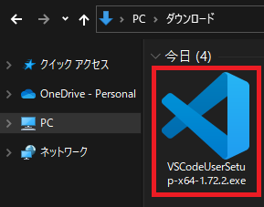

# 1-3：Pythonの環境構築
[前ページ(1-2：言語について)](./1-02.md)　｜　[目次へ戻る](../index.md)　｜　[次ページ(2-1：hello world)](../02_practice/2-01.md)
- - -

## Pythonのインストール

Pythonを使うためにはPythonをインストールする必要があります。

本ページではWindowsでのインストール方法のみを紹介するので、MacOSの方は各自で調べてインストールしてください。

以下のPython公式ページにアクセスします。
- [Welcome to Python.org](https://www.python.org/)

ページの「Download」タブにマウスを合わせるとPythonインストーラのダウンロードボタンが出てくるのでそれをクリックします。

ダウンロードしたインストーラをダブルクリックして起動させます。

インストーラを起動させると以下のような画面になるので、左下のチェックボックス2つにチェックを入れます。

あとはインストーラーの指示に従っていけばPythonのインストールは終了します。

インストールが終了したら「Winキー + Rキー」を押下し「ファイル名を指定して実行」ダイアログを表示させて「powershell」と入力してEnterキーを押下します。

PowerShellが起動するので以下のコマンドを入力してEnterキーを押下します。

~~~
python -V
~~~

以下のようにエラーなくPythonのバージョンが表示されればPythonのインストールは正常にできています。

## Visual Studio Codeのインストール

Pythonがインストールできたので、次はプログラムを書くためのエディタであるVisual Studio Codeをインストールします。

以下の公式ダウンロードページにアクセスします。
- [Download Visual Studio Code Mac, Linux, Windows](https://code.visualstudio.com/download)

赤枠のWindowsのボタンをクリックしてインストーラをダウンロードします。

ダウンロードしたインストーラをダブルクリックして起動させます。

インストーラを起動させると以下のような画面になるので「同意する」を選択して「次へ」をクリックします。

チェックはそのままで「次へ」をクリックします。

確認画面でインストールする内容を確認して「インストール」をクリックします。

あとはインストールが完了するまで待ちます。

インストール完了後、Visual Studio Codeを起動するか、適当なテキストファイルを右クリックした際に「Codeで開く」の項目が追加されていれば正常にインストールできています。

## Visual Studio Codeの日本語化とPythonの拡張機能の追加
Visual Studio Codeはデフォルトのままだとメニューなどが英語のままなので、日本語化を行います。

Visual Studio Codeを起動させて左側にあるメニューの四角いアイコンの「拡張機能」をクリックし、検索欄に「japanese」と入力して出てきた一番上にある「Japanese Language Pack for Visual Studio Code」の「インストール」ボタンをクリックしてインストールします。

これでメニューなどが日本語になります。表示が変わらない場合はVisual Studio Codeを一度終了させてからもう一度起動してみてください。

次にPythonを書きやすくするための拡張機能もあるのでそれもインストールしていきます。

先ほどと同じように、左側にあるメニューの四角いアイコンの「拡張機能」をクリックし、検索欄に「python」と入力して出てきた一番上にある「Python」の「インストール」ボタンをクリックしてインストールします。

これでPython自体のインストールとエディタの準備ができたので、次のページからは実際にPythonプログラムを書いていきます。

- - -
[前ページ(1-2：言語について)](./1-02.md)　｜　[目次へ戻る](../index.md)　｜　[次ページ(2-1：hello world)](../02_practice/2-01.md)