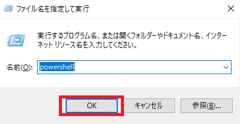
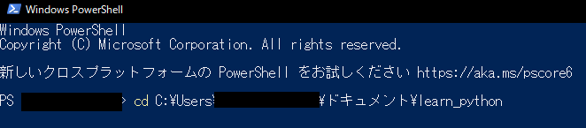

# 2-1：hello world

[前ページ(1-3：Pythonの環境構築)](../01_preparation//1-03.md)　｜　[目次へ戻る](../index.md)　｜　[次ページ(2-2：変数)](./2-02.md)
- - -
プログラミング業界で言うhello worldとは「そのプログラミング言語でhello worldと表示させる」ことを意味します。

初めて触るプログラミング言語を学習する際、まずはhello worldをやってみるというのが一般的です。

本ページではこの慣習に合わせて、まずはPythonでhello worldを表示させてみます。

またPythonファイルを実行するやり方も説明します。

## 作業用フォルダの作成

まず最初にマイドキュメントでもどこでも良いので作業用のフォルダを作成してください。

今回は例として「learn_python」というフォルダをマイドキュメント配下に作成したとして進めます。このフォルダ内にPythonのファイルを作成していきます。

## hello worldのPythonプログラムの作成

作業フォルダを作成できたらVisual Studio Codeを起動させます。

メニューの「ファイル」→「新しいテキストファイル」をクリックします。

「Untitled」というタブが追加されます。

この追加された「Untitled」というタブのところで以下の内容を記述します。

~~~python
prit("hello world")
~~~

実際に行うと以下のようになります。

記述できたらメニューの「ファイル」→「名前を付けて保存」をクリックします。

保存ダイアログが出てくるので、保存先を作業用フォルダにし、ファイル名を「2-01_hello_world」にします。そしてファイルの種類を「Python」にしてから「保存」ボタンをクリックします。

これでちゃんとPythonソースファイルとして保存されます。

保存されたファイルをVisual Studio Codeで開くと以下のようになっているはずです。

特に注意して見てほしいのは赤枠の文字コードのところです。これが「UTF-8」となっているか確認してください。

PythonのソースコードはUTF-8で書かれていることが多いので、文字コードは合わせるようにしてください。例えばこれが「Shift-JIS(SJIS)」などの場合、日本語で記述した部分が文字化けして正常に動かなくなります。

もしUTF-8の文字コードになっていなかった場合は、以下のように文字コード部分をクリックして出てきた「エンコード付きで保存」をクリックします。

文字コードが選択できるので「UTF-8」をクリックすることで、その選択した文字コードでファイル保存されます。

## hello worldの実行

hello worldのPythonファイルが準備できたので実行します。

今回はPowerShellから実行しますが、コマンドプロンプトから実行することもできます。

キーボードの「Winキー + Rキー」を押下して「ファイル名を指定して実行」を表示させ、名前欄のところに「powershell」と入力してEnterキーを押下します。ちなみにWinキーとはWindowsのマークになっているキーです。

以下のようにPowerShellが起動します。

PowerShellを起動させたら、作業用フォルダを表示させ赤枠部分をクリックして色が変わったところで「Ctrl + Cキー」で作業用フォルダまでのパスをコピーします。

コピーできたらPowerShellの画面に戻って「cd」と記述した後に半角スペースを入力し、その後マウスの右クリックを押下すると先ほどコピーしたパスがペーストされます。

実際に行うと以下のようになります。

この状態でEnterキーを押下すると作業用フォルダに移動します。

ここまでのコマンドの内容についてはページ最後の方に記した「コマンドの補足」で解説しているので、気になる方はそちらを参照してください。

作業フォルダまで移動できたのでPythonファイルを実行します。

Pythonの実行コマンドは以下の通りです。

~~~
python [ファイル名]
~~~

今回はファイル名を「2-01_hello_world.py」としているので以下のコマンドになります。

~~~
python 2-01_hello_world.py
~~~

このコマンドを先ほどのPowerShellで入力してEnterキーを押下してみてください。すると以下のような結果になったと思います。

「hello world」と表示させたかったのに、よくわからない英語の羅列が表示されています。

これは「正しい記述ではないためエラーが発生した」ということになります。

プログラムを書いているとこのようにエラーが頻発するので、今回はあえて間違った記述をしてエラーを発生させました。

## エラー文の内容から解決方法を探す

エラーが出た場合、まずはどのようなエラーが出ているかを確認するためにエラー文をしっかりと読みます。

エラー文は以下のようになっています。

~~~python
Traceback (most recent call last):
  File "C:\Users\xxx\xxxx\ドキュメント\learn_python\2-01_hello_world.py", line 1, in <module>
    prit("hello world")
NameError: name 'prit' is not defined. Did you mean: 'print'?
~~~

このエラー文には「どのファイルのどの行でどのようなエラーが発生しているか」が書かれています。

まず「File」と書かれている後にはファイル名があるので、そのファイルでエラーが発生していることがわかります。

その後に「line 1」と書かれているので対象ファイルの1行目でエラーとなっていることがわかります。

そして最後に「NameError: name 'prit' is not defined. Did you mean: 'print'?」と書かれています。この「NameError」というのが発生しているエラーの種類です。

エラーの名前からなんとなく内容は推測できますが、ちゃんと調べるためにGoogleを開いて「python NameError」と検索すると以下のようにページがヒットします。

検索でヒットしたページを開いていき、エラーの内容や解決策が書かれてあるものが見つかるまで探します。

いくつかページを読んでいくと「name 'prit' is not defined.」が「prit」という定義がされてないということがわかるかと思います。

そしてその後にエラー文で続いている「Did you mean: 'print'?」とあるため「pritではなくprintと記述する」のが正しいことがわかると思います。

このようにプログラムを書いて実行してエラーが出た場合は、そのエラー文をしっかりと読んでそれがどのようなエラーなのか、どのように解決すれば良いかを地道に調べる必要があります。

## ソースコードを修正し再度実行して確認

解決策がわかったので実際にソースコードを修正していきます。

hello worldの中身を以下のように書き換えて上書き保存し、再度実行してみてください。

~~~python
print("hello world")
~~~

実行すると以下のようにエラーは発生せずに「hello world」と文字が表示されます。

これでPythonのhello worldができたことになります。

ちなみに今回使った「print」とはPythonのデフォルト機能にある関数（2-6で解説します）で以下のように使います。

~~~python
print([文字列])

print("hello world") # 例
~~~

また「# 例」と書いてある部分がありますが、この「#」の後に書いた内容はPythonの中で無視されるので、メモや処理の内容を書いておきたい場合は「#」を使います。

これをプログラミング業界では「コメントを書く」と言います。

## hello worldを終えて

「hello worldという文字を表示させるだけなのに面倒くさい！」と思った方、正解です。

「1-1：プログラミングで大事なこと」でも書きましたが、プログラムを書くのは基本的に面倒くさく地道で泥臭い作業です。

今回はhello worldという文字を表示させるだけでしたが、もっと複雑なプログラムは世の中にあふれています。例えばゲームのように3DCGを動かしたり、対戦相手とのリアルタイム通信などを考えるとそれを先ほどのようにエラーなく記述するのはものすごく大変です。

なので、繰り返しになりますが「試行錯誤する作業を楽しめる」ようにならないとプログラミングは辛いだけの作業になります。

この試行錯誤を楽しみながらプログラムを書いていきましょう。

## コマンドの補足
本ページの途中で行った「cd」とは「チェンジディレクトリ」の略で、そのフォルダまで移動するというコマンドになります。

~~~
cd [移動したい先のパス]
~~~

- - -
[前ページ(1-3：Pythonの環境構築)](./1-03.md)　｜　[目次へ戻る](../index.md)　｜　[次ページ(2-2：変数)](./2-02.md)