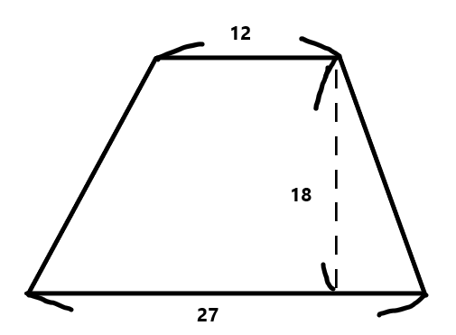

# 2-3：四則演算

[前ページ(2-2：変数)](./2-02.md)　｜　[目次へ戻る](../index.md)　｜　[次ページ(2-4：if文)](./2-04.md)
- - -
プログラムは基本的に数式の計算をさせることが多いです。

本ページは四則演算、つまりは足し算、引き算、掛け算、割り算の説明をしていきます。

## 四則演算の書き方

Pythonでの四則演算の書き方は以下のようになります。

### ・足し算
~~~python
x = 4
y = 2
answer = x + y # 足し算の計算
print(answer)  # 結果「6」
~~~

### ・引き算
~~~python
x = 4
y = 2
answer = x - y # 引き算の計算
print(answer)  # 結果「2」
~~~

### ・掛け算
~~~python
x = 4
y = 2
answer = x * y # 掛け算の計算(アスタリスクを使う)
print(answer)  # 結果「8」
~~~

### ・割り算
~~~python
x = 4
y = 2
answer = x / y # 掛け算の計算(スラッシュを使う)
print(answer)  # 結果「2.0」
~~~

### ・補足：割り算の余り
~~~python
x = 5
y = 2
answer = x % y # 掛け算の計算(%を使う)
print(answer)  # 結果「1」
~~~

これらはもちろん組み合わせることもできます。
~~~python
x = 5
y = 2
z = 6
answer = (x + y) - z * x / y
print(answer)  # 結果「-8.0」
~~~

プログラムで計算される順序は小学校で習った順序通りです。

つまりは以下の優先順位で計算されます。
- 1：カッコ内の計算
- 2：掛け算、割り算の計算
- 3：足し算、割り算の計算

## 練習問題

四則演算の練習として以下の問題をPythonで書いてみてください。

- 以下の台形の面積を計算するプログラム

ちなみに計算結果として「351」と求められれば正解です。

以下に解答例を隠していますが、できるだけ自力で書いてみてください。

解答例

<b>・2-02_calc_trapezium.py</b>
 
<pre>
upper  = 12 # 上底
lower  = 27 # 下底
height = 18 # 高さ

answer = (upper + lower) * height / 2 # 台形の面積 = (上底 + 下底) * 高さ / 2
print(answer)
</pre>

- - -
[前ページ(2-2：変数)](./2-02.md)　｜　[目次へ戻る](../index.md)　｜　[次ページ(2-4：if文)](./2-04.md)