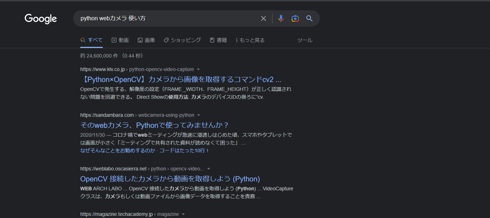

# 3-1：目的を実現するための考え方

[前ページ(2-11：変数の値が変わる場合)](../02_practice/2-11.md)　｜　[目次へ戻る](../index.md)　｜　[次ページ(3-2：プログラミングに便利な道具)](./3-02.md)
- - -

ここからは応用編になります。

本ページではプログラミングをする際に自分が目的を実現するために考えていることややっていることをできるだけ言語化したいと思います。

## 目的を明確にする

Pythonに限らず、プログラムがある程度書けるようになると「こういうプログラムを作りたい」など色々と思うようになるかと思います。

その場合にまずやることは「目的を明確にする」ことです。「仕様を明確にする」とも言えますが、とにかく具体的な目的にしていきます。

例えば「PythonでWebカメラを使って何かしたい」ではなく「PythonでWebカメラの画像を取得してリアルタイムで表示したい。またPボタンを押下することでカメラ画像をpng形式の現在日時のファイル名で保存したい」など、より具体的なものにします。

とは言え、そこまで具体的にしていけない場合もあると思うので、次の「目的を細分化する」と「実現手段を調べ、試す」と平行して具体的なものにしていきます。

## 目的を細分化する

目的が定まったらその最終目的を実現するために、達成できそうな小さい目的に細分化していきます。

先のWebカメラを例にすると、以下の細分化された目的が全て達成できれば最終目的の機能が実現できそうです。

- PythonでWebカメラを認識させる
- PythonでWebカメラの画像をリアルタイムで表示する
- Pythonでキー入力を検知する
- Pythonで現在日時を取得する
- Pythonで画像を保存する

この「目的の細分化」は慣れていないとなかなか難しいと思いますが、仕事などあらゆる場面でも使えるので「何か達成したい目的、解決したい問題」がある場合はその「細分化」を意識してみましょう。

## 具体的な実現手段を調べ、試す

目的が細分化できたら、それらを実現する「手段」を調べて試していきます。

先のWebカメラを例にすると、まずは「PythonでWebカメラを認識させる」を実現したいです。

なのでGoogleなどの検索エンジンで「python webカメラ 使い方」などで検索します。検索すると以下のように色々とページがヒットします。

次に検索結果のページを上から順番に開いてひたすら読んでいきます。ページの中にサンプルコードなどがあれば書いてある通りにやって実行して試します。

自分の理想とする目的を達成できそうな情報がそのページにない場合は、検索結果の次のページに目を通して手段が見つかるまで探します。そして手段が見つかって目的を達成できたら、次の目標についても同じように調べて試すを繰り返します。

そうやって細分化した目的を一つ一つできるようにしていきます。

## 細分化した目的を組み合わせて最終目的を達成する

細分化した目的一つ一つを達成したら、それらを組み合わせて最終目的を実現していきます。

一つ一つはできていても、組み合わせたソースコードを作るのもそれなりに時間がかかるので、トライアンドエラーで上手く動くようになるまで修正していきます。

根気強くバグを修正していき、最終目的を達成しましょう。

## メンテナンスしやすいようにコメント追記や関数、クラス、ファイル分けをする

ある程度動くようになったら、メンテナンスしやすいようにコメントの追加や関数やクラス、ファイル分けをしていきます。

もちろん最後ではなくソースコードを書き始める前や書いている途中に行うのが理想ですが、まずは動くことが優先されるので、個人開発であればメンテナンス性は後回しでも良いです。

ただし、__「自分が書いたブログラムでも数日経てば他人のプログラムと同じ」__なので、将来の自分が困らないように適宜コメントや関数、クラス分けなどをして何をやっているかがわかるようにしておきましょう。

- - -
[前ページ(2-11：変数の値が変わる場合)](../02_practice/2-11.md)　｜　[目次へ戻る](../index.md)　｜　[次ページ(3-2：プログラミングに便利な道具)](./3-02.md)